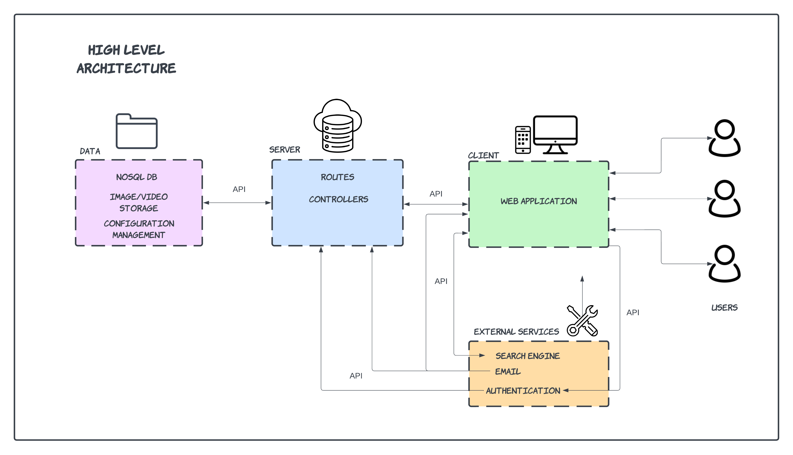

# WiE Database Software Architecture

We plan to build the application using MVC style.

## Architecture Diagram

The project will be a straightforward web application. Our approach involves building upon a React framework, with a Node.js express server dedicated to handling API requests and communications between the database and various external services such as
authentication and tracking user analytics.

The main abstractions in our architecture
are the Data, Service, Application, and External Function Abstractions. These different components have separate responsibilities that work together to
provide value. A summary of their responsibilities is provided.

Data:
Manage storage/access of the different data components of our application

Service:
Handle handle routing and requests from clients. Business Logic

Application:
Serves as an interface for users to interact with our system

External Function:
Integration of external services as part of our proposition

## Technologies

The list of technologies we will use to build the application are as follows:

| Technology |
| ---------- |
| Firebase   |
| Express.js |
| React.js   |
| Node.js    |
| Algolia    |
| Tailwind   |
| Jest       |
| Cypress    |
| Netlify    |
| Vite       |
